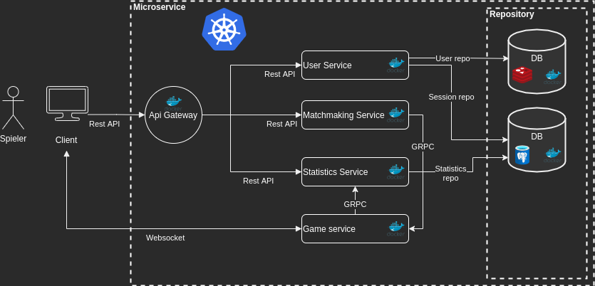
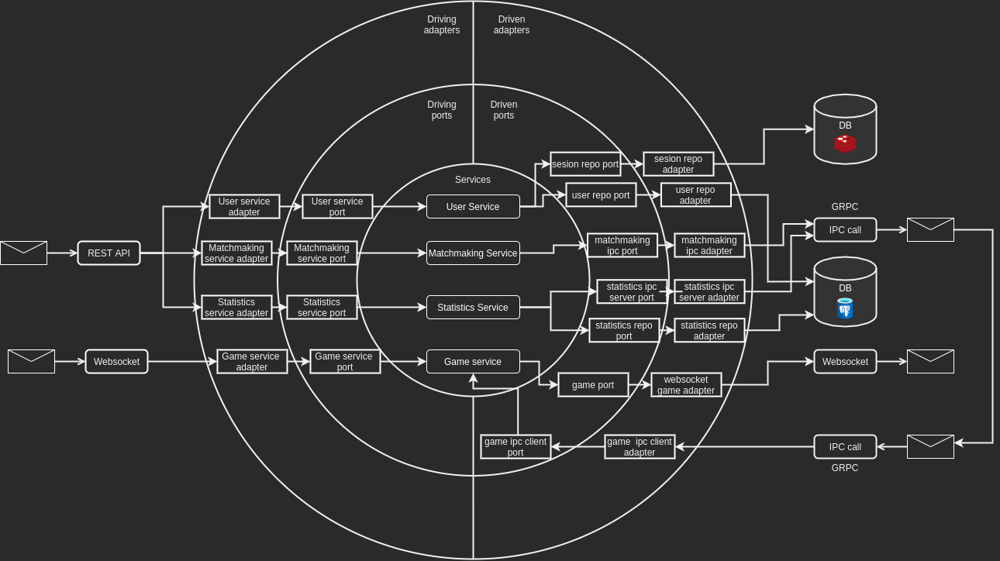

# tetris_battle_royale

## Installation
Note: Setup and tooling are developed with a linux system in mind, it was tested with minikube v1.25.1 and postgres 14.2 on Ubuntu 21.10.
```bash
# Install javascript dependencies for the frontend
cd client
npm install
cd ..

# Install go dependencies for the backend
cd microservice && go mod tidy

# Install protobuf compiler and grpc plugin: https://grpc.io/docs/languages/go/quickstart/
go install google.golang.org/protobuf/cmd/protoc-gen-go@v1.28
go install google.golang.org/grpc/cmd/protoc-gen-go-grpc@v1.2

# Install minikube: https://minikube.sigs.k8s.io/docs/start/
curl -LO https://storage.googleapis.com/minikube/releases/latest/minikube-linux-amd64
sudo install minikube-linux-amd64 /usr/local/bin/minikube

# Compile protofiles (in microservice/ directory)
./make_protofiles.sh
```

To use the database, you need to create a config file specifying connection options.
The file should be called `.postgres_credentials.env ` and have content like the following example:
```
TBR_PG_HOST=db
TBR_PG_USER=admin
TBR_PG_DB=postgresdb
TBR_PG_PASSWORD=test123
```
The above configuration can be used to connect to the cluster-internal postgres database.
Your configuration file needs to be copied into the minikube cluster:
```bash
minikube cp ./.postgres_credentials.env /mnt/secrets-data/.postgres_credentials.env
```

## How to run

```bash
# Start service
./deploy_cluster
# Check that all pods are running; Ready should be 1/1 and Status Running for all pods
kubectl get pods
```
Should output something like the following:
```
NAME                                   READY   STATUS    RESTARTS      AGE
db-d67f6fddd-zkskk                     1/1     Running   0             56s
game-service-857649784-vr87c           1/1     Running   0             56s
gateway-5bb8fb8b7d-b92p4               1/1     Running   0             56s
matchmaking-service-7ddf5dd876-2mpsg   1/1     Running   2 (36s ago)   56s
redis-79dfbdc577-5dwmm                 1/1     Running   0             56s
statistics-service-5645d67985-rjvw9    1/1     Running   2 (35s ago)   56s
user-service-769749cf45-47lxl          1/1     Running   2 (35s ago)   56s
```
```bash
kubectl logs service/gateway
```
Should output something like the following:
```
2022/04/16 10:27:02 Registered backend service at endpoint /user
2022/04/16 10:27:02 Registered backend service at endpoint /statistics
2022/04/16 10:27:02 Registered backend service at endpoint /game
2022/04/16 10:27:02 Registered backend service at endpoint /matchmaking
2022/04/16 10:27:02 Starting http server on Port 8080
```
```bash
# forward connection from you machines :8080 to the clusters internal network's :8080
kubectl port-forward services/gateway 8080:8080
```
The final setup step is to import the database schema:
```bash
kubectl exec -i services/db -- psql -U admin -d postgresdb < schema.sql
```
You should now be able to interact with the microservice, for testing purposes, open a new terminal and run the following code to register a new user:
```bash
curl -X POST -H "Content-type: application/json" -d '{"username": "foo", "password": "bar"}' 'localhost:8080/user/register'
```
The output will look something like the following:
```
{
    "sessionID": "bad9227f-07fb-4e21-9171-efd837d0a161", 
    "userID": "bad9227f-07fb-4e21-9171-efd837d0a161", 
    "username": "foo"
}
```
To launch the frontend, run `npm run start` in the `client/` directory and navigate to `localhost:3000` in your browser.

## Service architecture

## Software architecture

## Package structure
```
cmd/
├── game_service/
├── gateway/
├── matchmaking_service/
├── statistics_service/
└── user_service/
internal/
├── core/
│   ├── driven_adapters/
│   │   ├── game_adapter/
│   │   ├── ipc/
│   │   │   └── grpc/
│   │   └── repository/
│   │       ├── postgres/
│   │       └── redis/
│   ├── driven_ports/
│   │   ├── ipc/
│   │   └── repository/
│   ├── driving_ports/
│   ├── protofiles/
│   │   ├── game_service/
│   │   ├── statistics_service/
│   │   └── user_service/
│   ├── services/
│   │   ├── game_service/
│   │   ├── matchmaking_service/
│   │   ├── statistics_service/
│   │   └── user_service/
│   └── types/
└── driving_adapters/
    ├── rest/
    └── websocket/
```
